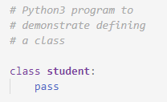
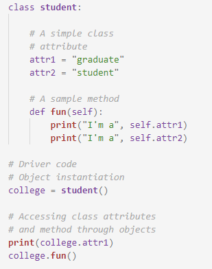
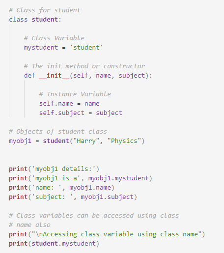

A class is a user-defined blueprint or prototype from which objects are created. Classes provide a means of bundling data and functionality together. Creating a new class creates a new type of object, allowing new instances of that type to be made  
Syntax: 
class class_name: 
statements 
  

<h4>How to define class objects</h4>
An Object is an instance of a Class. A class is like a blueprint while an instance is a copy of the class with actual values. 
An object consists of :  

State: It is represented by the attributes of an object. It also reflects the properties of an object. 
Behavior: It is represented by the methods of an object. It also reflects the response of an object to other objects. 
Identity: It gives a unique name to an object and enables one object to interact with other objects  

Syntax: 
Object_name.class_name()  
Program  
  
Output  
graduate 
I'm a graduate 
I'm a student  
<b>The self</b>
Class methods must have an extra first parameter in the method definition. We do not give a value for this parameter when we call the method, Python provides it. 
If we have a method that takes no arguments, then we still have to have one argument. 
When we call a method of this object as myobject.method(arg1, arg2), this is automatically converted by Python into MyClass.method(myobject, arg1, arg2)  
__init__ method 
The __init__ method is similar to constructors in C++ and Java. Constructors are used to initializing the object’s state. It runs as soon as an object of a class is instantiated. The method is useful to do any initialization you want to do with your object.  
Program  

Output  
Hello, my name is John  
Class and Instance Variables:  
Class variables is a variable that is shared by all instances of a class. They are defined within a class but outside any of the class's methods.  
Instance Variable is a variable that is defined inside a method and belongs only to the current instance of a class.  
Program  
  
Output  
myobj1 details: 
myobj1 is a student 
Breed:  Harry 
Color:  Physics 

Accessing class variable using class name 
student 

